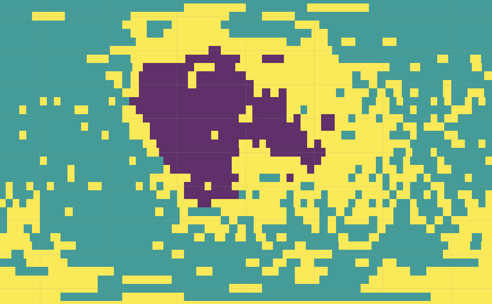

<!-- Improved compatibility of back to top link: See: https://github.com/othneildrew/Best-README-Template/pull/73 -->
<a id="readme-top"></a>
<!--
*** Thanks for checking out the Best-README-Template. If you have a suggestion
*** that would make this better, please fork the repo and create a pull request
*** or simply open an issue with the tag "enhancement".
*** Don't forget to give the project a star!
*** Thanks again! Now go create something AMAZING! :D
-->


<!-- PROJECT SHIELDS -->
<!--
*** I'm using markdown "reference style" links for readability.
*** Reference links are enclosed in brackets [ ] instead of parentheses ( ).
*** See the bottom of this document for the declaration of the reference variables
*** for contributors-url, forks-url, etc. This is an optional, concise syntax you may use.
*** https://www.markdownguide.org/basic-syntax/#reference-style-links
-->
[![Contributors][contributors-shield]][contributors-url]
[![Forks][forks-shield]][forks-url]
[![Stargazers][stars-shield]][stars-url]
[![Issues][issues-shield]][issues-url]
[![Unlicense License][license-shield]][license-url]
[![LinkedIn][linkedin-shield]][linkedin-url]


<!-- PROJECT LOGO -->
<br />
<div align="center">
  <a href="https://github.com/AGBV/GRS-workshop">
    
  </a>

  <h3 align="center">Python Workshop GRS</h3>

  <p align="center">
    Workshop: Application of machine learning algorithms to GRS data in Python
    <br />
    <a href="https://github.com/AGBV/GRS-workshop"><strong>Explore the docs »</strong></a>
    <br />
    <br />
    <a href="https://github.com/AGBV/GRS-workshop">View Demo</a>
    &middot;
    <a href="https://github.com/AGBV/GRS-workshop/issues/new?labels=bug&template=bug-report---.md">Report Bug</a>
    &middot;
    <a href="https://github.com/AGBV/GRS-workshop/issues/new?labels=enhancement&template=feature-request---.md">Request Feature</a>
  </p>
</div>

<!-- TABLE OF CONTENTS -->
<details>
  <summary>Table of Contents</summary>
  <ol>
    <li>
      <a href="#about-the-project">About The Project</a>
      <ul>
        <li><a href="#built-with">Built With</a></li>
      </ul>
    </li>
    <li>
      <a href="#getting-started">Getting Started</a>
      <ul>
        <li><a href="#prerequisites">Prerequisites</a></li>
        <li><a href="#installation">Installation</a></li>
      </ul>
    </li>
    <li><a href="#usage">Usage</a></li>
    <li><a href="#roadmap">Roadmap</a></li>
    <li><a href="#contributing">Contributing</a></li>
    <li><a href="#license">License</a></li>
    <li><a href="#contact">Contact</a></li>
    <li><a href="#acknowledgments">Acknowledgments</a></li>
  </ol>
</details>

<!-- ABOUT THE PROJECT -->
## About The Project
This project demonstrates how to apply unsupervised machine learning (specifically K-Means clustering) to Lunar Prospector Gamma-Ray Spectrometer (GRS) data. The main goal is to create an automated geochemical map of the Moon and interpret the results in terms of known lunar geology.

Key Features:
*   Loads and preprocesses NASA planetary data from the Planetary Data System (PDS).
*   Demonstrates the importance of data normalization for machine learning.
*   Uses the Elbow Method to determine the optimal number of clusters for K-Means.
*   Creates a geochemical map of the Moon based on the clustering results.
*   Interprets the geochemical signatures of the identified clusters.

<p align="right">(<a href="#readme-top">back to top</a>)</p>


### Built With
This section repository is build with:
* 
* ![Matplotlib][matplotlib-shield]

<p align="right">(<a href="#readme-top">back to top</a>)</p>

<!-- GETTING STARTED -->
## Getting Started

This is an example of how you may give instructions on setting up your project locally.
To get a local copy up and running follow these simple example steps.

### Prerequisites
The project uses the following Python libraries:

*   jupyter
*   matplotlib
*   polars
*   scikit-learn

### Installation
To get a local copy up and running, follow these steps:

1.  Clone the repository:
    ```bash
    git clone https://github.com/AGBV/GRS-workshop.git
    cd GRS-workshop
    ```
2.  Install the required dependencies using a package manager like `pip` or `uv`:
    ```bash
    pip install jupyter matplotlib polars scikit-learn
    # or using uv
    # uv pip install jupyter matplotlib polars scikit-learn
    ```

_Below is an example of how you can instruct your audience on installing and setting up your app. This template doesn't rely on any external dependencies or services._

<p align="right">(<a href="#readme-top">back to top</a>)</p>


<!-- USAGE EXAMPLES -->
## Usage
To run the analysis, open and execute the Jupyter Notebook:

```bash
jupyter notebook workshop.ipynb
```

The notebook will guide you through the process of data loading, preprocessing, K-Means clustering, and visualization of the results, culminating in a geochemical map of the Moon.

<p align="right">(<a href="#readme-top">back to top</a>)</p>

<!-- ROADMAP -->
## Roadmap

- [x] Add Changelog
- [x] Add back to top links
- [ ] Add Jupyter Notebook for Random Forest methods
- [ ] Add Additional Templates w/ Examples
- [ ] Add "components" document to easily copy & paste sections of the readme
- [ ] Multi-language Support
    - [ ] Korean
    - [ ] German

See the [open issues](https://github.com/AGBV/GRS-workshop/issues) for a full list of proposed features (and known issues).

<p align="right">(<a href="#readme-top">back to top</a>)</p>


<!-- CONTRIBUTING -->
## Contributing

Contributions are what make the open source community such an amazing place to learn, inspire, and create. Any contributions you make are **greatly appreciated**.

If you have a suggestion that would make this better, please fork the repo and create a pull request. You can also simply open an issue with the tag "enhancement".
Don't forget to give the project a star! Thanks again!

1. Fork the Project
2. Create your Feature Branch (`git checkout -b feature/AmazingFeature`)
3. Commit your Changes (`git commit -m 'Add some AmazingFeature'`)
4. Push to the Branch (`git push origin feature/AmazingFeature`)
5. Open a Pull Request

### Top contributors:

<a href="https://github.com/AGBV/GRS-workshop/graphs/contributors">
  
</a>

<p align="right">(<a href="#readme-top">back to top</a>)</p>

<!-- LICENSE -->
## License
Distributed under the MIT License. See `LICENSE.txt` for more information.

<p align="right">(<a href="#readme-top">back to top</a>)</p>

<!-- CONTACT -->
## Contact

Tom Sander - tom.sander@tu-dortmund.de

Project Link: [https://github.com/AGBV/GRS-workshop](https://github.com/AGBV/GRS-workshop)

<p align="right">(<a href="#readme-top">back to top</a>)</p>


<!-- ACKNOWLEDGMENTS -->
## Acknowledgments

The following recources were used:
* [Choose an Open Source License](https://choosealicense.com)
* [GitHub Emoji Cheat Sheet](https://www.webpagefx.com/tools/emoji-cheat-sheet)
* [Img Shields](https://shields.io)
* [Font Awesome](https://fontawesome.com)

<p align="right">(<a href="#readme-top">back to top</a>)</p>


<!-- MARKDOWN LINKS & IMAGES -->
<!-- https://www.markdownguide.org/basic-syntax/#reference-style-links -->
[contributors-shield]: https://img.shields.io/github/contributors/AGBV/GRS-workshop.svg?style=for-the-badge
[contributors-url]: https://github.com/AGBV/GRS-workshop/graphs/contributors
[forks-shield]: https://img.shields.io/github/forks/AGBV/GRS-workshop.svg?style=for-the-badge
[forks-url]: https://github.com/AGBV/GRS-workshop/network/members
[stars-shield]: https://img.shields.io/github/stars/AGBV/GRS-workshop.svg?style=for-the-badge
[stars-url]: https://github.com/AGBV/GRS-workshop/stargazers
[issues-shield]: https://img.shields.io/github/issues/AGBV/GRS-workshop.svg?style=for-the-badge
[issues-url]: https://github.com/AGBV/GRS-workshop/issues
[license-shield]: https://img.shields.io/github/license/AGBV/GRS-workshop.svg?style=for-the-badge
[license-url]: https://github.com/AGBV/GRS-workshop/blob/master/LICENSE.txt
[linkedin-shield]: https://img.shields.io/badge/-LinkedIn-black.svg?style=for-the-badge&logo=linkedin&colorB=555
[linkedin-url]: https://www.linkedin.com/in/tom-sander-54374a20a/

[matplotlib-shield]: https://img.shields.io/badge/matplotlib-3.10-65B9EA.svg?style=for-the-badge&logo=data:image/svg%2bxml;base64,PD94bWwgdmVyc2lvbj0iMS4wIiBlbmNvZGluZz0iVVRGLTgiPz4KPHN2ZyB4bWxucz0iaHR0cDovL3d3dy53My5vcmcvMjAwMC9zdmciIHdpZHRoPSIxODAiIGhlaWdodD0iMTgwIiBzdHJva2U9ImdyYXkiPgo8ZyBzdHJva2Utd2lkdGg9IjIiIGZpbGw9IiNGRkYiPgo8Y2lyY2xlIGN4PSI5MCIgY3k9IjkwIiByPSI4OCIvPgo8Y2lyY2xlIGN4PSI5MCIgY3k9IjkwIiByPSI2NiIvPgo8Y2lyY2xlIGN4PSI5MCIgY3k9IjkwIiByPSI0NCIvPgo8Y2lyY2xlIGN4PSI5MCIgY3k9IjkwIiByPSIyMiIvPgo8cGF0aCBkPSJtOTAsMnYxNzZtNjItMjYtMTI0LTEyNG0xMjQsMC0xMjQsMTI0bTE1MC02MkgyIi8+CjwvZz48ZyBvcGFjaXR5PSIuOCI+CjxwYXRoIGZpbGw9IiM0NEMiIGQ9Im05MCw5MGgxOGExOCwxOCAwIDAsMCAwLTV6Ii8+CjxwYXRoIGZpbGw9IiNCQzMiIGQ9Im05MCw5MCAzNC00M2E1NSw1NSAwIDAsMC0xNS04eiIvPgo8cGF0aCBmaWxsPSIjRDkzIiBkPSJtOTAsOTAtMTYtNzJhNzQsNzQgMCAwLDAtMzEsMTV6Ii8+CjxwYXRoIGZpbGw9IiNEQjMiIGQ9Im05MCw5MC01OC0yOGE2NSw2NSAwIDAsMC01LDM5eiIvPgo8cGF0aCBmaWxsPSIjM0JCIiBkPSJtOTAsOTAtMzMsMTZhMzcsMzcgMCAwLDAgMiw1eiIvPgo8cGF0aCBmaWxsPSIjM0M5IiBkPSJtOTAsOTAtMTAsNDVhNDYsNDYgMCAwLDAgMTgsMHoiLz4KPHBhdGggZmlsbD0iI0Q3MyIgZD0ibTkwLDkwIDQ2LDU4YTc0LDc0IDAgMCwwIDEyLTEyeiIvPgo8L2c+PC9zdmc+&logoColor=white